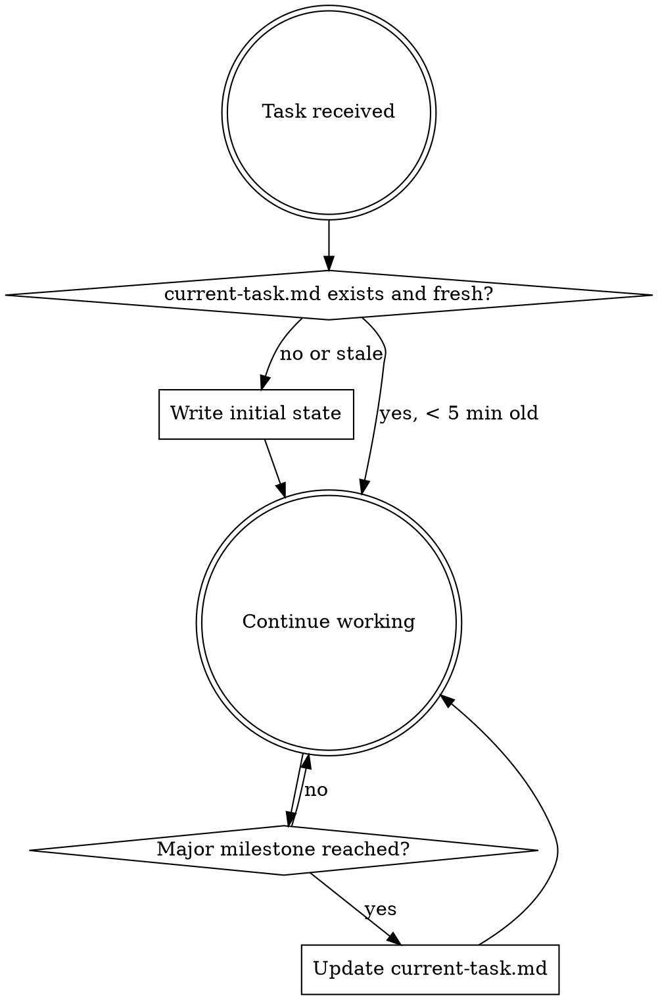

# Context Guard

## Overview

You have **claude-rules-keeper** installed. Your conversation context can be compacted at any time. To prevent losing progress, you MUST maintain `~/.claude/rules-keeper/current-task.md` with your current state.

## When to Write



**Write at these moments:**
1. **Task start** - immediately after understanding what the user wants
2. **After major decisions** - architecture choices, approach changes
3. **After completing a step** - what was done, what comes next
4. **Before stopping** - final state of work

## Format

Write to `~/.claude/rules-keeper/current-task.md`:

```markdown
# Current Task

Objective: [what the user wants - be specific and actionable]
Key files: [files being worked on, max 10]
Decisions made: [important choices - tech, approach, constraints]
Rules to follow: [coding standards, user preferences, constraints]
Last action: [what was just completed]
Next step: [what should happen next]

---
Updated: [timestamp or "manual"]
```

**Keep it under 15 lines.** Focus on what a fresh Claude instance needs to resume work seamlessly.

## Red Flags

| Thought | Reality |
|---------|---------|
| "I'll write it later" | Compaction can happen at any time. Write NOW. |
| "The task is too simple" | Even simple tasks have context worth saving. |
| "I just started" | Perfect time to write the objective. |
| "I'll remember" | You won't. Compaction erases everything. |

## After Compaction

If you see `[COMPACTION RECOVERY]` in your context, you are resuming after compaction:
1. Read the recovered context carefully
2. Summarize what you understand to the user
3. Ask for confirmation before continuing
4. Update `current-task.md` with any corrections
